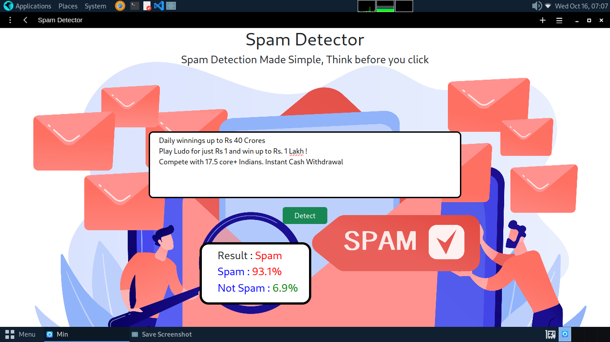

# Spam Detector

## Overview
This is a web-based spam detection application that analyzes input text and classifies it as spam or not. The project combines a user-friendly interface with a machine learning model for accurate prediction. 

## Features
- Simple input form for text analysis
- Real-time spam prediction using a trained machine learning model
- Flask-based backend for web functionality

## Technologies Used
- **Frontend**: HTML, CSS
- **Backend**: Python (Flask)
- **Machine Learning**: Sklearn

## Screenshots




## Installation

### Prerequisites
- Python 3.x
- Flask
- Required Python libraries (specified in `requirements.txt`)

### Steps to Run
1. Clone this repository:
    ```bash
    git clone https://github.com/Dhineshkumarprakasam/Spam_detector.git
    ```
2. Navigate to the directory:
    ```bash
    cd Spam_detector
    ```
3. Install the required packages:
    ```bash
    pip install -r requirements.txt
    ```
4. Run the application:
    ```bash
    python app.py
    ```
5. Open `http://localhost:5000` in your browser to access the spam detector.

## Project Structure
```
Spam_detector/
│
├── .github/ workflows/        # GitHub workflow files
├── models/                    # Pre-trained machine learning model files
├── static/                    # CSS and static files
│   └── css/
├── templates/                 # HTML templates
├── app.py                     # Main Flask application
├── requirements.txt           # List of dependencies
└── LICENSE                    # MIT License
```

## License
This project is licensed under the MIT License.
